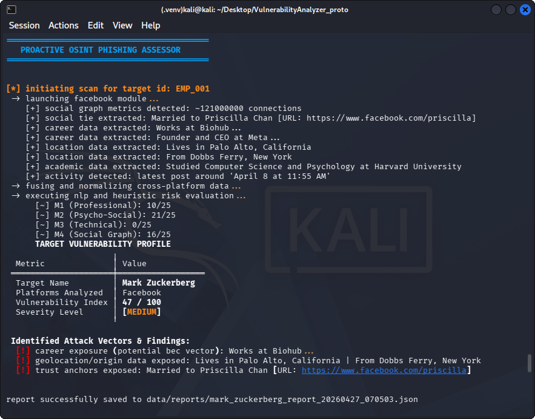

# Proactive User Vulnerability Assessment Method Against Targeted Phishing Based on OSINT Data

## Overview
This repository contains a specialized OSINT (Open Source Intelligence) framework designed to proactively assess individual vulnerability to targeted phishing (Spear Phishing) attacks. By automating the collection and semantic analysis of publicly available data from multiple social platforms, the utility calculates a quantitative Risk Index (0-100) and identifies specific attack vectors.

This project was developed as part of a Bachelor's Thesis to demonstrate the integration of automated data scraping, Natural Language Processing (NLP), and heuristic risk modeling in the field of Cybersecurity.

## Key Features
- **Multi-Source Data Aggregation**: Modular scrapers for LinkedIn, GitHub, and Facebook.
- **Cross-Platform Identity Resolution**: A normalization engine that merges disparate data points into a unified digital profile.
- **NLP-Powered Analysis**: Utilizes `spaCy` (Named Entity Recognition) to identify corporate entities, technologies, and behavioral markers.
- **Heuristic Scoring Model**: A mathematical framework that evaluates risk across four distinct modules (M1-M4).
- **Automated Reporting**: Generates human-readable terminal reports and machine-readable JSON exports for security auditing.

## Technical Architecture
The system follows a modular, decoupled architecture to ensure scalability and maintainability:

1. **Extraction Layer (`scrapers/`)**: Leveraging `Playwright` and `BeautifulSoup4` for resilient, asynchronous data retrieval.
2. **Normalization Layer (`core/normalizer.py`)**: Consolidates raw data, removes duplicates, and prepares unified text for semantic processing.
3. **Analysis Layer (`core/analyzer.py`)**: The "Heuristic Engine" that executes NLP tasks and calculates the final Vulnerability Index.
4. **Presentation Layer (`core/reporter.py`)**: Utilizes the `Rich` library for professional CLI visualization and data serialization.

## Methodology: The M1-M4 Scoring Model
The risk assessment logic is based on a multi-criteria heuristic model. The total vulnerability index is calculated as the sum of four specialized modules, each contributing up to 25% of the final score to ensure a balanced risk profile.

### Evaluation Modules

#### M1: Professional Role & Environment Exposure (Max: 25 pts)
Evaluates corporate data that can be weaponized for Business Email Compromise (BEC) attacks.
- **Job Details**: Analysis of access levels to internal processes (e.g., C-level executives, financial roles, or lead developers).
- **Employer Publicity**: Determination of corporate culture and footprint to craft realistic lures.
- **Contact Vectors**: Identification of direct communication channels such as work emails or corporate messengers.

#### M2: Socio-Psychological Context (Max: 25 pts)
Determines emotional exposure levels for building high-trust attack legends.
- **Social Ties**: Detection of exposed data regarding family and relationships to exploit trust triggers.
- **Geolocation**: Extraction of residence data, educational history, or hometown information.
- **Profile Openness**: Analysis of digital privacy boundaries and posting frequency.

#### M3: Technical Exposure & Identity (Max: 25 pts)
Assesses technical artifacts primarily used to target IT staff and supply chain infrastructure.
- **Tech Stack**: Identification of programming languages, frameworks, and infrastructure tools (AWS, Docker, K8s).
- **Public Projects**: Evaluation of contributions to open-source projects and project popularity (GitHub stars).
- **Digital Identifiers**: Tracking shared handles and nicknames across platforms for identity resolution.

#### M4: Social Graph Depth (Max: 25 pts)
Measures the external attack surface through the target's network and professional history.
- **Network Size**: Assessment of follower/connection counts to facilitate impersonation of colleagues or recruiters.
- **Work/Education History**: Chronology of previous workplaces enabling "old acquaintance" attack vectors.
- **Activity Level**: Monitoring public actions to determine the target's digital pulse and optimal attack timing.

### Threat Severity Levels
The final Vulnerability Index is categorized into three severity tiers:
- **Low (0-29)**: Minimal data exposure; requires significant manual reconnaissance for an attack.
- **Medium (30-59)**: Sufficient data for basic spear phishing; work history and network context are visible.
- **High (60-100)**: Critical exposure; direct contacts, tech stack, and trust anchors are fully available.

## Prerequisites
- Python 3.8+
- Playwright (with Chromium browser)
- spaCy (en_core_web_sm model)

## Installation and Setup
1. Clone the repository:
   ```bash
   git clone [https://github.com/dieshie/proactive-osint-phishing-assessor.git](https://github.com/dieshie/proactive-osint-phishing-assessor.git)
   cd proactive-osint-phishing-assessor
2. Create and activate a virtual environment:
   ```bash
   python3 -m venv venv
   source venv/bin/activate
3. Install dependencies:
   ```bash
   pip install -r requirements.txt
4. Install Playwright browsers:
   ```bash
   playwright install chromium
5. Download the NLP model:
   ```bash
   python -m spacy download en_core_web_sm

## Usage

Configure your target list in data/targets.json:
   ```bash
{
    "targets": [
        {
            "id": "Target_01",
            "last_name": "Surname",
            "social_links": {
                "github": "[https://github.com/username](https://github.com/username)",
                "facebook": "[https://www.facebook.com/username](https://www.facebook.com/username)"
            }
        }
    ]
}
```
Execute the scanning pipeline:
   ```bash
python main.py
```
## Usage Example
Below is a demonstration of the `VulnerabilityAnalyzer` processing a sample dataset:



## Disclaimer
This tool is for educational and authorized security auditing purposes only. The developer is not responsible for any misuse of this software. Always adhere to the Terms of Service of the platforms being analyzed and local privacy laws.